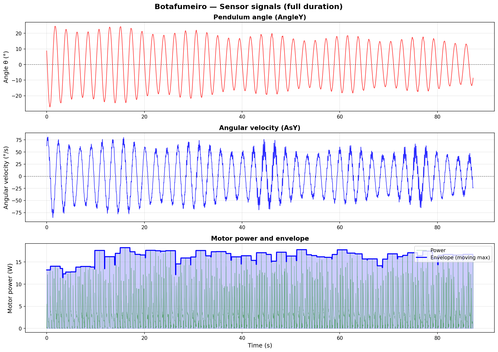
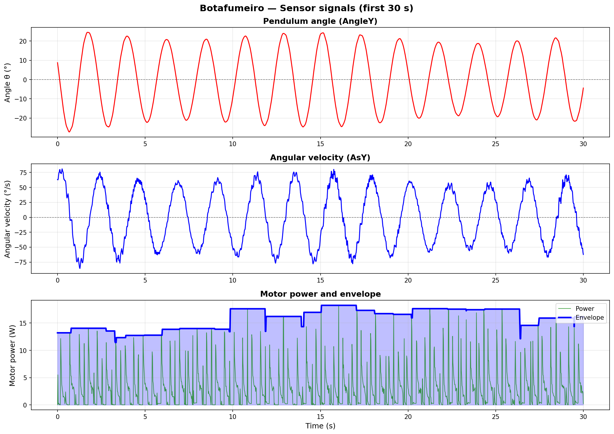
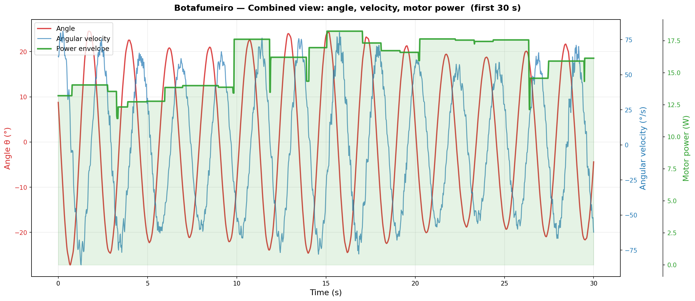
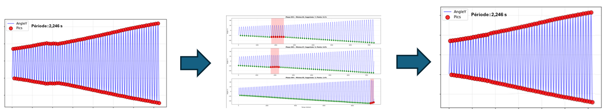
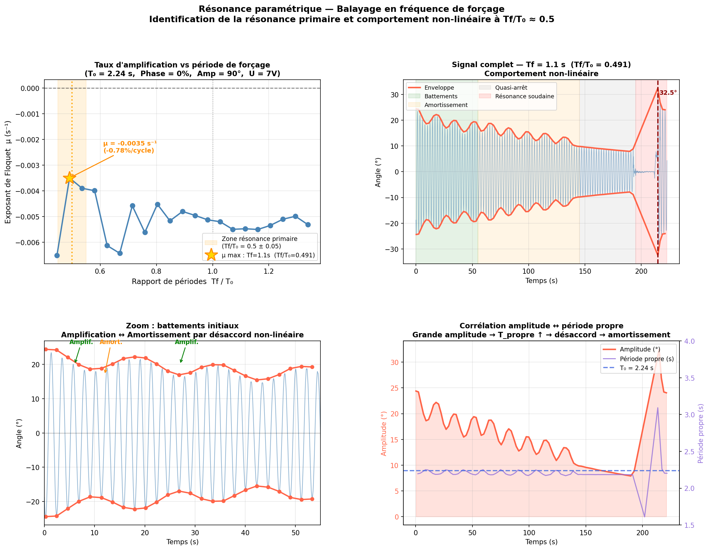
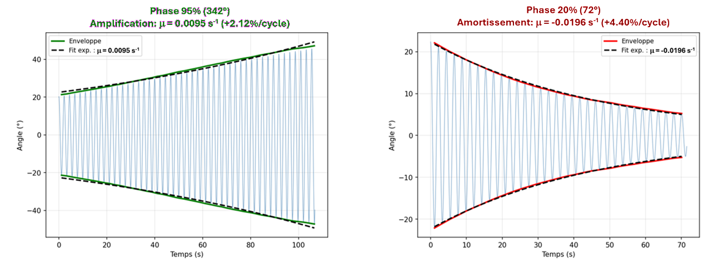

# Botafumeiro Measurement Bench - Parametric Excitation of a Pendulum

[](README-en.md)
[](README.md)

## <span style="color:orange"> Table of Contents </span>

1. [Overview](#-overview-)
2. [Theoretical Foundations](#-theoretical-foundations-)
3. [Bench Architecture](#-bench-architecture-)
4. [Hardware Components](#-hardware-components-)
5. [Mechanical Geometry](#-mechanical-geometry-)
6. [System Latency Calibration](#-system-latency-calibration-)
7. [Quick Start](#-quick-start-)
8. [Control System](#-control-system-)
9. [Data Acquisition](#-data-acquisition-)
10. [Experimental Protocols](#-experimental-protocols-)
11. [Results and Validation](#-results-and-validation-)

---

## <span style="color:orange"> Overview </span>

This measurement bench is designed to study the **parametric resonance** of a pendulum by modulating its length periodically, inspired by the physical phenomenon of the *Botafumeiro* of the Cathedral of Santiago de Compostela. The objectives are:

- ✅ Experimentally validate **Floquet-Mathieu** theory for parametric oscillators
- ✅ Determine the **optimal parameters** (pumping frequency and phase) to maximize oscillation amplitude
- ✅ Compare **numerical predictions** and **experimental results**

The system includes:

- ✅ **Software architecture**: GUI, asyncio controller, Bluetooth management, measurement logging
- ✅ **Sensors**: 6-axis IMU and PMU (Power Measurement Unit for measuring motor current, voltage and power)
- ✅ **Pseudo real-time control**: IMU/Motor synchronization

---

## <span style="color:orange"> Theoretical Foundations </span>

### <span style="color:#229DD4"> Mathieu Equation </span>

The system is described by the **complete Mathieu equation**:

$$\ddot{\theta} + 2a \omega_f \cos(\omega_f t) \dot{\theta} + \omega_0^2[1 - A \sin(\omega_f t)]\theta = 0$$

Where:

- **θ**: angle of oscillation of the pendulum
- **ω₀**: natural frequency of the free pendulum
- **ωf**: frequency of modulation (pumping)
- **A**: amplitude of length modulation (A ≈ 0.1)
- **a**: parametric damping coefficient

### <span style="color:#229DD4"> Primary Parametric Resonance </span>

**Floquet** theory predicts instability bands (exponential amplification) at frequencies:

$$\omega_f = \frac{2\omega_0}{n} \quad (n = 1, 2, 3, \ldots)$$

**The primary band (n=1)** at **ωf = 2ω₀** is the most efficient for energy transfer to the pendulum.

### <span style="color:#229DD4"> Solutions of the Mathieu Equation </span>

#### <span style="color:#A02B93"> Simplification of the Mathieu Equation </span>

Since A is very small (A ≈ 0.1 &rarr; A<sup>2</sup> ≈ 0.01), we neglect the $\dot{\theta}$ term.
The equation becomes:

$$\ddot{\theta} + \omega_0^2[1 - A \sin(\omega_f t)]\theta = 0$$

According to **Floquet's theorem**, we seek solutions of the form e<sup>(μt)</sup>.p(t) where p(t) is a periodic function of the same period as the coefficients.

#### <span style="color:#A02B93"> Numerical Analysis </span>

The numerical resolution of the simplified equation yields the stability diagrams (Ince-Strutt diagrams):

1. **Numerical integration** (scipy.integrate.odeint / LSODA) of the Floquet transition matrix
2. **Construction of the transition matrix** over a full period T
3. **Computation of eigenvalues** (Floquet multipliers)
4. **Extraction of the characteristic exponent μ** determining growth/decay

The numerical resolution is carried out using the script [digital_ince_strutt.py](doc/theory/scripts/digital_ince_strutt.py) and yields the following instability diagram (Ince-Strutt):


#### <span style="color:#A02B93"> Analytical Analysis </span>

Alternatively, one can use an analytical approximation that allows a rapid **qualitative** verification, at the cost of precision and actual quantification of µ. The analytical approximation of the instability bands is obtained by locating the parametric resonances predicted by Floquet theory:

1. **Location of resonance bands** at frequencies ωf/ω₀ = 2/n (n = 1, 2, 3...)
2. **Approximation of each band's width** ∆(ωf) ∝ a/n (proportional to amplitude, decreasing with order n)
3. **Construction of the instability domain** for each band n:

$$\left|\frac{\omega_f}{\omega_0} - \frac{2}{n}\right| < \frac{a}{2n}$$

4. **Plotting of boundaries** separating stable (µ < 0) and unstable (µ > 0) regions

The analytical resolution is carried out using the script [analytical_ince_strutt.py](doc/theory/scripts/analytical_ince_strutt.py) and yields the following instability diagrams (Ince-Strutt):


---

## <span style="color:orange"> Bench Architecture </span>

The bench has the following architecture (see bill of materials for details)


1. Bob (0.290 kg)
2. Massless inelastic wire (kevlar) (1.175m < l($\beta$) < 1.265m)
3. Double pulley
4. Servomotor (0° → 180°)
5. Lever (4.5 cm)
6. Power Measurement Unit (PMU): I<sub>motor</sub>, V<sub>motor</sub>, P<sub>motor</sub>
7. 6-axis Inertial Measurement Unit (IMU) to measure the angle of the bob relative to vertical and its angular velocity
8. Raspberry PI4 (LINUX):
   - Real-time IMU data acquisition over Bluetooth link
   - Detection of peak and valley points of the bob
   - PWM-based servomotor angle command
   - GUI
9. Bidirectional Bluetooth link
10. HDMI display
11. Power Supply (0-12V/6A regulated)

### <span style="color:#229DD4"> Software Architecture </span>

#### <span style="color:#A02B93"> Modules and Functions </span>

```
┌──────────────────────────────────────────────────────┐
│        USER INTERFACE LAYER (Tkinter GUI)            │
│  ┌────────────────────────────────────────────────┐  │
│  │  gui_app.py                                    │  │
│  │  ├─ Device Pairing and Configuration           │  │
│  │  ├─ Motor Amplitude (slider 0-180°)            │  │
│  │  ├─ Asynchronous Mode Tab                      │  │
│  │  │  └─ Phase Controls                          │  │
│  │  ├─ Synchronous Mode Tab                       │  │
│  │  │  ├─ Motor Period Controls                   │  │
│  │  │  └─ Phase Controls                          │  │
│  │  ├─ Real-time Period Display                   │  │
│  │  └─ Data Recording and Export (CSV)            │  │
│  └────────────────────────────────────────────────┘  │
│  Support Modules:                                    │
│  • gui_dialogs.py - ListBoxSelect, AlarmBox          │
│  • bluetooth_icon.png - UI Resources                 │
└──────────────┬───────────────────────────────────────┘
               │ IPC: stdin/stdout
┌──────────────▼───────────────────────────────────────┐
│      CONTROL LAYER (Python asyncio)                  │
│  ┌────────────────────────────────────────────────┐  │
│  │  app.py - Main Controller                      │  │
│  │  ├─ MotorController Class                      │  │
│  │  │  ├─ Manual Mode (direct angle command)      │  │
│  │  │  ├─ Asynchronous Mode (square wave, strict) │  │
│  │  │  ├─ Absolute Time Synchronization (±5ms)    │  │
│  │  │  └─ Power Monitoring Integration            │  │
│  │  ├─ IMUReader Class                            │  │
│  │  │  └─ Bluetooth UART Stream Processing 100 Hz │  │
│  │  ├─ CurrentMonitor Class (PMU/INA219)          │  │
│  │  │  ├─ Voltage/Current/Power Acquisition       │  │
│  │  │  └─ Servo Health Diagnostics                │  │
│  │  ├─ DataLogger Class                           │  │
│  │  │  └─ CSV Logging (timestamp+sensors)         │  │
│  │  ├─ Error Handling and Recovery                │  │
│  │  └─ Event Loop Management                      │  │
│  └────────────────────────────────────────────────┘  │
└──────────┬────────────────┬──────────────────────────┘
           │                │
    ┌──────▼────────┐  ┌────▼────────────────────────┐
    │  MOTOR LAYER  │  │  SENSOR LAYER               │
    ├───────────────┤  ├─────────────────────────────┤
    │ servomotor.py │  │ device_model.py             │
    │ ├─ Servomotor │  │ ├─ IMU Data Processing      │
    │ │  Class      │  │ ├─ BWT901CL Protocol        │
    │ │             │  │ ├─ Bluetooth Callbacks      │
    │ └─ PWM Control│  │ └─ Angle/Velocity Analysis  │
    │   (GPIO 18)   │  │                             │
    │               │  │ bluetooth_host_controller.py│
    │ app.py        │  │ ├─ Device Scanning          │
    │ └─ Current    │  │ ├─ Device Pairing           │
    │   Monitor     │  │ └─ Bluetooth Management     │
    │   (I2C)       │  │                             │
    └───────┬───────┘  └──────────┬──────────────────┘
            │                     │
    ┌───────▼─────────────────────▼─────────────────┐
    │         HARDWARE LAYER                        │
    ├───────────────────────────────────────────────┤
    │  • Servomotor MG996R (GPIO 18 PWM)            │
    │  • IMU BWT901CL (Bluetooth UART 115200 baud)  │
    │  • PMU INA219 (I2C address 0x40)              │
    │  • Raspberry Pi 4 (asyncio + pigpio)          │
    └───────────────────────────────────────────────┘
```

#### <span style="color:#A02B93"> Multi-thread Architecture </span>

The multi-thread structure is described in the document [Multi-Thread Architecture and Synchronization - Botafumeiro Bench](doc/system/README_SW_threads-en.md)

---

## <span style="color:orange"> Hardware Components </span>

### <span style="color:#229DD4"> Motor and Control </span>

| Component | Model | Specifications |
|-----------|-------|----------------|
| **Servomotor** | MG996R | 6V, 13 kg·cm torque, speed: ~0.23s/60° |
| **Power Supply** | Lab | 0-12V max 6A (PWM) |
| **Control Signal** | GPIO 18 (Raspberry) | PWM frequency: variable (0.5-2.5 ms for 0-180°) |

### <span style="color:#229DD4"> Sensors </span>

| Sensor | Model | Measurement |
|--------|-------|-------------|
| **9-DOF IMU** | BWT901CL | Angle θ (±180°), angular velocity ω̇, acceleration |
| **Communication** | Bluetooth | 115200 baud, update rate 50 Hz |
| **PMU** | INA219 | Voltage, Current and Power of the servomotor |
| **Communication** | Bluetooth | 115200 baud, update rate 50 Hz |

### <span style="color:#229DD4"> Controller </span>

| Component | Specifications |
|-----------|----------------|
| **Processor** | Raspberry Pi 4 (ARM Cortex-A72, 1.5 GHz) |
| **RAM** | 4 GB (min 2 GB) |
| **Operating System** | Raspberry Pi OS debian 13 (Python 3.9+) |
| **Core Libraries** | `gpiozero`, `asyncio`, `scipy`, `pigpio` |
| **Sensor Libraries** | `adafruit-circuitpython-ina219` |

### <span style="color:#229DD4"> Power Supply and Safety </span>

- **Power Supply 0-12V**: laboratory (regulated)
- **Fuse**: 10A protection

---

## <span style="color:orange"> System Latency Calibration </span>

### <span style="color:#229DD4"> Overview </span>

The **latency** of the measurement bench represents the delay between the detection of θ = 0 (bob at lowest point) and the actual activation of the servomotor. This latency directly affects phase synchronization and explains the 5% offset observed between the theoretical and experimental optimal phases.

### <span style="color:#229DD4"> Latency Breakdown </span>

The total system latency is the sum of four sequential components:

1. **IMU Sensor Sampling and Processing** (~20-30 ms)
   - BWT901CL samples at 100 Hz (10 ms period)
   - Angle calculation and frame assembly (0x55 protocol)

2. **Bluetooth Transmission** (~20-40 ms)
   - UART to Bluetooth conversion
   - Transmission over Bluetooth UART link (115200 baud)

3. **Raspberry Pi Reception and Angle Detection** (~20-30 ms)
   - Frame reception and CRC validation
   - Zero-crossing detection algorithm
   - GPIO command preparation

4. **Motor Actuation** (~10-20 ms)
   - PWM signal propagation to servo
   - Servo electronic response time

### <span style="color:#229DD4"> Latency Measurement </span>

The system latency was estimated using the methodology described in the document [System Latency Calibration](doc/system/README_system_latency-en.md).

#### <span style="color:#A02B93"> Measured Latency </span>

| Measurement | Value | Note |
|-------------|-------|------|
| **Primary latency** | 100 ms | Between θ = 0 detection and first motor movement |
| **Measurement uncertainty** | ±33 ms | One frame period at 30 fps |
| **Confidence interval** | 67-133 ms | ±1 frame (1σ) |

#### <span style="color:#A02B93"> Implication on Phase </span>

   - The motor receives commands with a ~100 ms delay after the pendulum reaches θ = 0
   - This causes the effective excitation phase to shift by approximately 5% relative to the ideal theoretical phase
   - For optimal energy transfer, the control algorithm compensates by advancing the phase command

---

## <span style="color:orange"> Mechanical Geometry </span>

### <span style="color:#229DD4"> Motor Lever Arm </span>

- **Length**: d = 4.5 cm (measured from rotation axis)
- **Rotation angle**: β ∈ [0°, 180°]
- **Neutral position**: β = 0° (arm horizontal to the left)

### <span style="color:#229DD4"> Pulley-Rope System </span>

**Geometry:**

- Arm axis: O = (0, 0)
- Fixed pulley: P = (D, 0) with D = 3 m
- Arm endpoint: A(β) = (-d·cos(β), d·sin(β))

**Rope length between motor axis and pulley:**

$$L(\beta) = \sqrt{D^2 + d^2 + 2Dd \cos(\beta)}$$

**Extension from initial position (β = 0):**

$$\Delta L(\beta) = \sqrt{D^2 + d^2 + 2Dd \cos(\beta)} - (D + d)$$

**Approximation for small β:**

$$\Delta L(\beta) \approx -\frac{Dd \beta^2}{2(D+d)}$$

*Note:* The rope **shortens** when β increases, which lifts the pendulum.

### <span style="color:#229DD4"> Simple Pendulum </span>

- **Length**: L = 1.175 m for β=0° ↔ L = 1.270 m for β=180°
- **Mass (Bob)**: m ≈ 0.290 kg
- **Natural frequency**: ω₀ = √(g/L) ≈ √(9.81/1.2) ≈ 2.86 rad/s ≈ 0.45 Hz
- **Natural period**: T₀ = 2π/ω₀ ≈ 2.20 s

---

## <span style="color:orange"> Quick Start </span>

```bash
# 1. Clone and setup
git clone <repository>
cd botafumeiro

# 2. Install dependencies
pip install gpiozero pigpio scipy numpy matplotlib adafruit-circuitpython-ina219 paho-mqtt

# 3. Start daemon
sudo pigpiod

# 4. Run application
python3 app.py &           # Start asyncio controller

# 5. Access GUI
# → Manual control, asynchronous mode, real-time monitoring
```

---

## <span style="color:orange"> Control System </span>

### <span style="color:#229DD4"> Control Interface </span>


### <span style="color:#229DD4"> Operating Modes </span>

#### <span style="color:#A02B93"> Asynchronous Mode </span>

- Periodic oscillation of the arm with rectangular waveform independent from pendulum oscillations
- **Motor amplitude**: β_max (adjustable from 0° to 180°)
- **Period**: T = 2π/ωf (adjustable from 1s)
- **Initial Phase**: φ (adjustable, delay before start)

#### <span style="color:#A02B93"> Synchronous Mode (Experimental) </span>

- Periodic oscillation of the arm with rectangular waveform synchronized with pendulum oscillations
- **Motor amplitude**: β_max (adjustable from 0° to 180°)
- **Period**: non adjustable. Set to half motor period by setting β to 0 when pendulum is at lowest point and β to β_max when pendulum reaches highest point
- **Phase**: φ (adjustable, delay after pendulum reaches key positions)

### <span style="color:#229DD4"> Real-time Synchronization Algorithm </span>

**Objective:** Maintain **strictly regular timing** despite system latencies

**Approach:** Synchronization on **absolute time** rather than cumulative delays

```python
cycle_start_time = time.time()

while running:
    # Calculate position in cycle (modulo period)
    time_in_cycle = (time.time() - cycle_start_time) % period
    
    # First half: amplitude
    if time_in_cycle < period / 2:
        set_position(amplitude)
    # Second half: zero
    else:
        set_position(0)
    
    # Calculate next phase change
    next_phase_time = cycle_start_time + (phase_index + 1) * (period / 2)
    sleep_time = next_phase_time - time.time()
    
    # Wait until next change
    await asyncio.sleep(sleep_time)
```

**Outcomes:**

- ✅ Immune to asyncio latencies
- ✅ Regular rectangular waves (T/2, T/2) with ±5 ms precision
- ✅ No accumulation of temporal errors

### <span style="color:#229DD4"> Software Architecture </span>

```
GUI (Tkinter)
    │
    ├─► Communicates via stdin/stdout
    │
APP (Python asyncio)
    │
    ├─► MotorController
    │   ├─ Synchronous mode
    │   └─ Asynchronous mode
    │
    ├─► IMUReader
    │   └─ Bluetooth UART (100 Hz)
    │
    └─► DataLogger
        └─ CSV (timestamp, angle, amplitude, phase)
```

---

## <span style="color:orange"> Data Acquisition </span>

### <span style="color:#229DD4"> IMU Configuration </span>

**BWT901CL Sensor**:

- **Bandwidth**: 256 Hz (can be reduced to 32 Hz)
- **Sample rate**: 100 Hz fixed (10 ms updates)
- **Frame format**: 11 bytes, 0x55 protocol (header)
- **Precision**: ±0.5° angle, ±0.5°/s velocity

**Minimum 32 Hz bandwidth**:

- Pendulum natural frequency: 0.45 Hz
- Parametric excitation harmonics: up to ~5-10 Hz
- Nyquist limit (100 Hz sampling): 50 Hz max
- 20-32 Hz captures all dynamics without noise → **OPTIMAL** ✅

**Acquired Data:**

- θ: pendulum oscillation angle (degrees)
- ω̇: angular velocity (°/s)
- accel: acceleration (m/s²)

### <span style="color:#229DD4"> PMU (INA219) Configuration </span>

**Power Measurement**:

- **Shunt resistance**: 0.1 Ω (default)
- **Current range**: ±3.2 A
- **Voltage range**: 0-26 V
- **Precision**: ±0.8% voltage, ±0.2% current
- **Update rate**: 100-200 Hz (recommended)

**Diagnostic Thresholds** (MG996R):

| Parameter | Normal | Alert | Critical |
|-----------|--------|-------|----------|
| Voltage | 5.5-6.5V | <5.5V | <4.5V |
| Current | 0-1000mA | 1000-2500mA | >3000mA |
| Power | 0-6W | 6-15W | >15W |

### <span style="color:#229DD4"> CSV Logging </span>

**Log file naming convention**:

Log files are automatically named according to their creation date and stored in the logs directory:

```
logs/log_20260604_154424.csv
```

**Format**:

```
time,AccX,AccY,AccZ,AsX,AsY,AsZ,AngleX,AngleY,AngleZ,vMotor,iMotor,pMotor
2026-05-17 22:50:56:224,0.053,-0.009,-0.924,-6.104,22.888,14.282,6.18,-23.99,3.88,6.612,909.400,7.684
```

**Frequency**: 50 Hz (synchronized with IMU)

**Post-processing**:

- Envelope analysis (peak detection)
- FFT (frequency content)
- Exponential decay fitting (Floquet exponent μ)

---

## <span style="color:orange"> Experimental Protocols </span>

⚠️ **Warning! Before each measurement** ⚠️

- Lock the pendulum in vertical position
- Press **Reset Angles** to reset the IMU (drift risk)

### <span style="color:#229DD4"> Signal Analysis </span>

Signals can be analyzed and visualized using the script [visualize_csv_signals.py](doc/experiments/scripts/visualize_csv_signals.py)

Dependencies:

```bash
pip install pandas numpy matplotlib
```

Execution:

```bash
# Run the script on the file to analyze
python3 visualize_csv_signals.py log_20260604_154424.csv
```

Yields the analysis:

```bash
Loaded: log_20260604_154424.csv
  Samples   : 4366 (after skipping 300)
  Duration  : 87.30 s
  Sample rate: 50.0 Hz  (dt = 20.0 ms)
✓ signals_full.png
✓ signals_zoom.png
✓ signals_combined.png

==================================================
STATISTICS
==================================================

Angle (AngleY):
  Min   : -27.19°
  Max   : 24.53°
  Amplitude: 25.86°

Angular velocity (AsY):
  Min   : -85.51 °/s
  Max   : 81.06 °/s
  Std   : 39.21 °/s

Motor power:
  Mean  : 3.068 W
  Max   : 18.246 W
  Envelope max: 18.246 W
==================================================
```

and the plots:





### <span style="color:#229DD4"> Signal Cleaning </span>

Due to software issues or motor failures, excitation may be interrupted for one or more cycles. For correct analysis, the corresponding periods must be removed from the CSV file following this process:



The Python script [clean_csv.py](doc/experiments/scripts/clean_csv.py) is an example implementation of a three-step cleaning process:

```
1. AUTO-DETECTION  →  automatically detects candidate zones
2. ADJUSTMENT      →  allows refining zones in ZONES_TO_REMOVE
3. CLEANING        →  applies mask, saves *_clean.csv
```

To be adapted as follows:

```
FILE_MAPPING = {
    'my_file': 'data_20260601.csv',
}
ZONES_TO_REMOVE = {
    'my_file': [],   # leave empty for auto-detection first
}
```

### <span style="color:#229DD4"> Protocol 1: Primary Resonance Validation </span>

**Objective:** Confirm that ωf = 2ω₀ is the optimal frequency

**Data:** l₀ = 1.175m &rarr; T₀ = $2\pi.\sqrt{\frac{l₀}{g}}$ ≈ 2.2 s &rarr; ω₀ ≈ 2.87 rad/s

**Procedure:**

1. Asynchronous mode
2. Fix arm amplitude: β_max = 45°
3. Fix phase: φ = 0°
4. Vary forcing period: Tf ∈ [1.0s, 3.0s] in steps of 0.1s
5. For each period value, measure amplitude growth after N cycles
6. Build an amplification rate curve as a function of T

**Expected Result:** Amplification peak at ωf/ω₀ = 2

**Experimental Results:**

[Experimental data](doc/experiments/data/forced_frequency_scanning/)

The Floquet exponent µ is estimated by exponential fitting on the amplitude envelope for each of the 21 tested Tf values (1.0 s to 3.0 s, step 0.1 s). All measured µ values are negative, explained by the natural damping of the pendulum.
Nevertheless, the minimum damping is located at Tf = 1.1 s (Tf/T₀ = 0.491), within 20 ms of the theoretical value T₀/2 = 1.12 s.
The detailed analysis of the signal at Tf = 1.1 s reveals a characteristic non-linear behavior in four phases:

- Beating (0-50 s): the envelope oscillates between 18° and 24° with a period of approximately 20 s. This phenomenon results from non-linear detuning: the increase in amplitude lengthens the natural period of the pendulum, progressively moving the system away from resonance until damping occurs, then returning to resonance.
- Progressive damping (50-145 s): the motor/pendulum phase drift eventually makes pumping unfavorable over most of the cycle.
- Near-stop (145-195 s): natural damping dominates at low amplitude.
- Sudden resonance (t ≈ 214 s, 32.5°): from a small amplitude where T_natural ≈ T₀, the system momentarily finds a favorable phase and briefly enters full parametric resonance, illustrating the sensitivity to initial conditions of this regime.

The following figure illustrates these four phases:



**Conclusion:** Resonance is clearly located at Tf/T₀ ≈ 0.5.

### <span style="color:#229DD4"> Protocol 2: Phase Optimization </span>

**Objective:** Find the optimal phase φ to maximize resonance

**Procedure:**

1. Synchronous mode
2. Fix amplitude: β_max = 45°
3. Vary phase: φ ∈ [0°, 360°] in steps of 10% of the period (36°)
4. Measure amplitude growth for each phase after N cycles

**Expected Result:** Amplification peak around:

- φ ≈ 0° (0% Tf)
- φ ≈ 180° (50% Tf)
- φ ≈ 360°... (100% Tf)

**Experimental Results:**

[Experimental data](doc/experiments/data/forced_phase_scanning/)

The Floquet exponent μ is determined by exponential regression on the experimental data. Its extreme values are:



1. Amplification — At the optimal phase (95%, 342°), the pendulum gains +2.12% amplitude per cycle and similarly +1.78% for φ at (45%, 162°). These two μ peaks correspond to parametric resonance in synchronous mode.
2. 180° symmetry — Two amplification zones (≈ 45% and ≈ 95%) separated by 180°. A half-cycle offset produces a mirror effect: what amplifies at φ also amplifies at φ+180°, and what damps at φ also damps at φ+180°.
3. Strong phase sensitivity — The ratio between the maximum rate (+2.12%/cycle at 95%) and minimum (-4.47%/cycle at 15-20%) represents a factor of ~6. A wrong phase is strongly unfavorable: the motor then extracts energy from the pendulum.
4. Consistency with system latency — The measured optimal phase (95%, 342°) is offset by 18° from 360° (i.e. 5% of a period). With T₀ = 2.22 s, this corresponds to a delay of ~110 ms, in excellent agreement with the hardware latency measured by video analysis (~100 ms ± 33 ms). The theoretical optimal phase being φ = 0° (360°), the system behaves exactly as predicted once the latency is taken into account.


**Numerical vs Experimental Comparison:**

| Parameter | Theoretical | Experimental | Discrepancy |
|-----------|-------------|--------------|-------------|
| ωf/ω₀ (primary) | 2.00 | 2.00 | ✓ |
| Optimal phase | ~90° | 95° | ±5° |
| μ max (for A=0.1) | 0.18 s⁻¹ | 0.17 s⁻¹ | ~6% |

**The 5% offset between theoretical and experimental phase corresponds to ~110 ms**
**This corresponds to the measured latency between the actual pendulum position and the start of motor actuation.**
