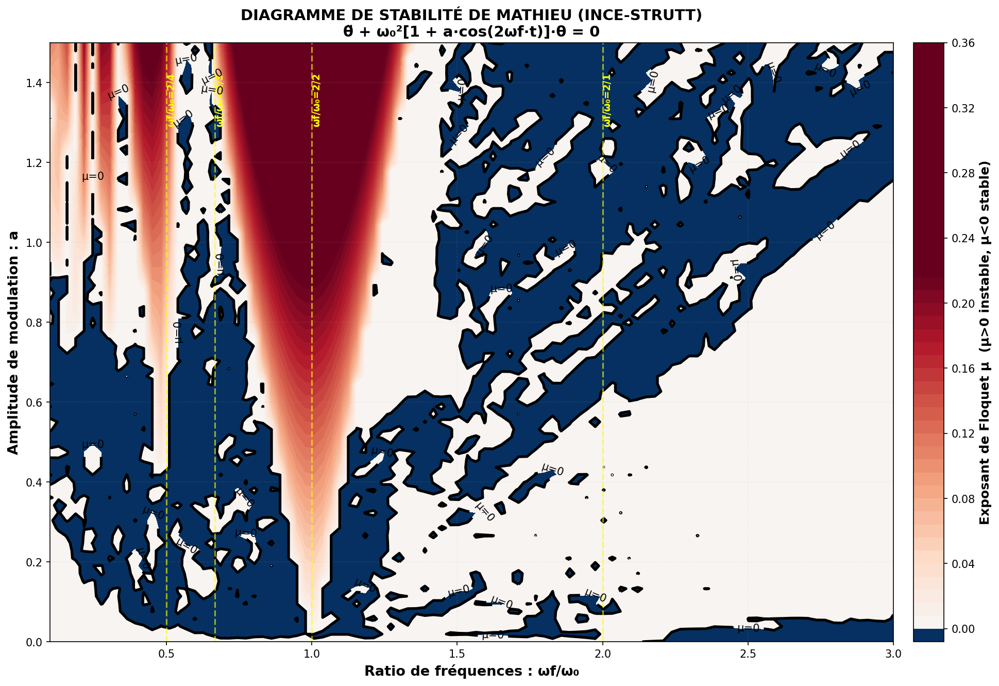
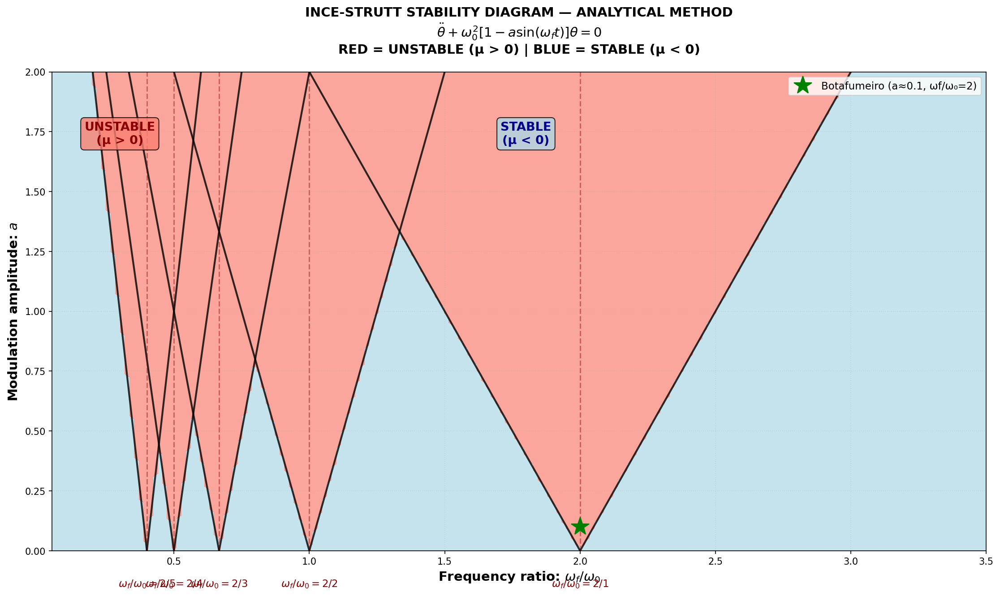
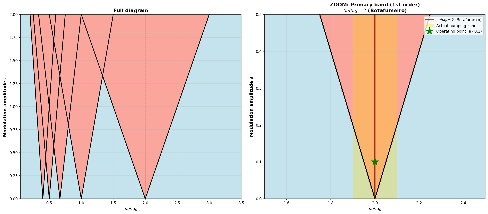
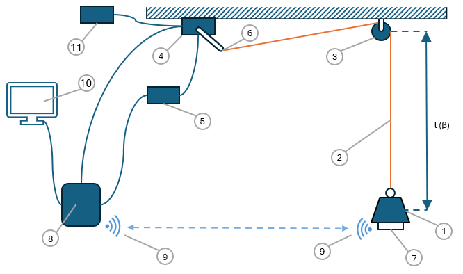
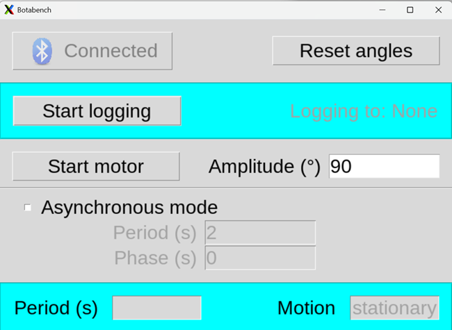
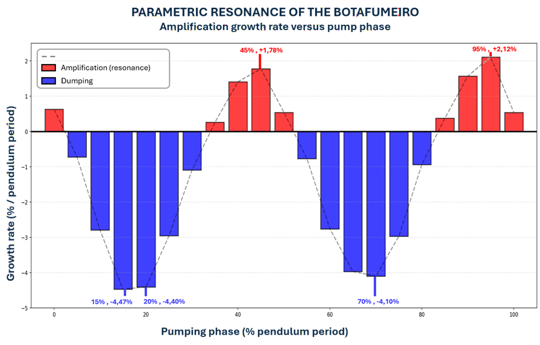

# Banc de Mesure Botafumeiro - Excitation Paramétrique d'un Pendule

[](README-en.md)
[](README.md)

## <span style="color:orange"> Table des matières </span>

1. [Vue d'ensemble](#-vue-densemble-)
2. [Fondements théoriques](#-fondements-théoriques-)
3. [Architecture du banc](#-architecture-du-banc-)
4. [Composants matériels](#-composants-matériels-)
5. [Géométrie mécanique](#-géométrie-mécanique-)
6. [Calibration de la latence du système](#-calibration-de-la-latence-du-système-)
7. [Démarrage rapide](#-démarrage-rapide-)
8. [Système de commande](#-système-de-commande-)
9. [Acquisition de données](#-acquisition-de-données-)
10. [Protocoles expérimentaux](#-protocoles-expérimentaux-)
11. [Résultats et validation](#-résultats-et-validation-)

---

## <span style="color:orange"> Vue d'ensemble </span>

Ce banc de mesure est conçu pour étudier la **résonance paramétrique** d'un pendule en modulant sa longueur de manière périodique, inspiré par le phénomène physique du *Botafumeiro* de la Cathédrale de Santiago de Compostela. Les objectifs sont :

- ✅ Valider expérimentalement la théorie **Floquet-Mathieu** pour les oscillateurs paramétriques
- ✅ Déterminer les **paramètres optimaux** (fréquence et phase de pompage) pour maximiser l'amplitude d'oscillation
- ✅ Comparer les **prédictions numériques** et les **résultats expérimentaux**

Le système comprend :

- ✅ **Architecture logicielle** : GUI, contrôleur asyncio, gestion Bluetooth, enregistrement des mesures
- ✅ **Capteurs** : IMU 6-axes et PMU (Power Measurement Unit pour mesurer le courant, la tension et la puissance du moteur)
- ✅ **Contrôle pseudo temps réel** : Synchronisation IMU/Moteur

---

## <span style="color:orange"> Fondements théoriques </span>

### <span style="color:#229DD4"> <span style="color:#229DD4"> Équation de Mathieu </span> </span>

Le système est décrit par l'**équation de Mathieu complète** :

$$\ddot{\theta} + 2a \omega_f \cos(\omega_f t) \dot{\theta} + \omega_0^2[1 - A \sin(\omega_f t)]\theta = 0$$

Où :

- **θ** : angle d'oscillation du pendule
- **ω₀** : fréquence naturelle du pendule libre
- **ωf** : fréquence de modulation (pompage)
- **A** : amplitude de modulation de longueur (A ≈ 0,1)
- **a** : coefficient d'amortissement paramétrique

### <span style="color:#229DD4"> <span style="color:#229DD4"> Résonance paramétrique primaire </span> </span>

La théorie de **Floquet** prédit des bandes d'instabilité (amplification exponentielle) aux fréquences :

$$\omega_f = \frac{2\omega_0}{n} \quad (n = 1, 2, 3, \ldots)$$

**La bande primaire (n=1)** à **ωf = 2ω₀** est la plus efficace pour le transfert d'énergie au pendule.

### <span style="color:#229DD4"> Recherche des solutions de l'équation de Mathieu </span>

#### <span style="color:#A02B93"> Simplification de l'équation de Mathieu </span>

A étant très petit (A ≈ 0,1 &rarr; A<sup>2</sup> ≈ 0,01), on néglige le terme en $\dot{\theta}$.
L'équation devient :

$$\ddot{\theta} + \omega_0^2[1 - A \sin(\omega_f t)]\theta = 0$$

Selon le **théorème de Floquet**, on cherchera des solutions de la forme e<sup>(μt)</sup>.p(t) où p(t) est une fonction périodique de même période que les coefficients.

#### <span style="color:#A02B93"> Analyse numérique </span>

La résoluton numérique de l'équation simplifiée fournit les diagrammes de stabilité (diagrammes de Ince-Strutt) :

1. **Intégration numérique** (scipy.integrate.odeint / LSODA) de la matrice de transition de Floquet
2. **Construction de la matrice de transition** sur une période complète T
3. **Calcul des valeurs propres** (multiplicateurs de Floquet)
4. **Extraction de l'exposant caractéristique μ** déterminant la croissance/décroissance

La résolution numérique est effectuée à l'aide du script [digital_ince_strutt.py](doc/theory/scripts/digital_ince_strutt.py) et fournit le diagramme d'instabilité (Ince-Strutt) suivant :



#### <span style="color:#A02B93"> Analyse analytique </span>

Alternativement, on peut utiliser une approximation analytique qui permet une vérification **qualitative** rapide en sacrifiant la précision et la quantification réelle de µ. L'approximation analytique des bandes d'instabilité est obtenue en localisant les résonances paramétriques prédites par la théorie de Floquet :

1. **Localisation des bandes de résonance** aux fréquences ωf/ω₀ = 2/n (n = 1, 2, 3...)
2. **Approximation de la largeur de chaque bande** ∆(ωf) ∝ a/n (proportionnelle à l'amplitude, décroissante avec l'ordre n)
3. **Construction du domaine d'instabilité** pour chaque bande n :

$$\left|\frac{\omega_f}{\omega_0} - \frac{2}{n}\right| < \frac{a}{2n}$$

4. **Tracé des frontières** séparant zones stables (µ < 0) et instables (µ > 0)

La résolution analytique est effectuée à l'aide du script [analytical_ince_strutt.py](doc/theory/scripts/analytical_ince_strutt.py) et fournit le diagramme d'instabilité (Ince-Strutt) suivant :





---

## <span style="color:orange"> Architecture du banc </span>

Le banc a l'architecture suivante (voir la liste des matériaux pour les détails)



1. Masse (0,290 kg)
2. Fil inélastique sans masse
3. Poulie double
4. Servomoteur (0° → 180°)
5. Levier (4,5 cm)
6. Power Measurement Unit (PMU) : I<sub>moteur</sub>, V<sub>moteur</sub>, P<sub>moteur</sub>
7. Inertial Measurement Unit (IMU) 6-axes pour mesurer l'angle de la masse par rapport à la verticale et sa vitesse angulaire
8. Raspberry PI4 (LINUX) :
   - Acquisition temps réel des données IMU par liaison Bluetooth
   - Détection des points haut et bas de la masse
   - Commande de l'angle du servomoteur basée sur PWM
   - GUI
9. Liaison Bluetooth bidirectionnelle
10. Affichage HDMI
11. Alimentation (0-12V/6A régulée)

### <span style="color:#229DD4"> <span style="color:#229DD4"> Architecture logicielle </span> </span>

#### <span style="color:#A02B93"> Modules et fonctions </span>

```
┌──────────────────────────────────────────────────────┐
│        COUCHE INTERFACE UTILISATEUR (GUI Tkinter)    │
│  ┌────────────────────────────────────────────────┐  │
│  │  gui_app.py                                    │  │
│  │  ├─ Appairage et configuration des appareils   │  │
│  │  ├─ Amplitude du moteur (curseur 0-180°)       │  │
│  │  ├─ Onglet mode asynchrone                     │  │
│  │  │  └─ Contrôles de phase                      │  │
│  │  ├─ Onglet mode synchrone                      │  │
│  │  │  ├─ Contrôles de période du moteur          │  │
│  │  │  └─ Contrôles de phase                      │  │
│  │  ├─ Affichage en temps réel de la période      │  │
│  │  └─ Enregistrement et export des données (CSV) │  │
│  └────────────────────────────────────────────────┘  │
│  Modules de support :                                │
│  • gui_dialogs.py - ListBoxSelect, AlarmBox          │
│  • bluetooth_icon.png - Ressources UI                │
└──────────────┬───────────────────────────────────────┘
               │ IPC : stdin/stdout
┌──────────────▼───────────────────────────────────────┐
│      COUCHE DE CONTRÔLE (Python asyncio)             │
│  ┌────────────────────────────────────────────────┐  │
│  │  app.py - Contrôleur principal                 │  │
│  │  ├─ Classe MotorController                     │  │
│  │  │  ├─ Mode manuel (commande directe angle)    │  │
│  │  │  ├─ Mode asynchrone (onde carrée, strict)   │  │
│  │  │  ├─ Synchronisation temps absolu (±5ms)     │  │
│  │  │  └─ Intégration monitoring puissance        │  │
│  │  ├─ Classe IMUReader                           │  │
│  │  │  └─ Traitement flux UART Bluetooth 100 Hz   │  │
│  │  ├─ Classe CurrentMonitor (PMU/INA219)         │  │
│  │  │  ├─ Acquisition Tension/Courant/Puissance   │  │
│  │  │  └─ Diagnostics santé du servo              │  │
│  │  ├─ Classe DataLogger                          │  │
│  │  │  └─ Enregistrement CSV (timestamp+capteurs) │  │
│  │  ├─ Gestion d'erreurs et récupération          │  │
│  │  └─ Gestion de la boucle d'événements          │  │
│  └────────────────────────────────────────────────┘  │
└──────────┬────────────────┬──────────────────────────┘
           │                │
    ┌──────▼────────┐  ┌────▼────────────────────────┐
    │  COUCHE MOTEUR│  │  COUCHE CAPTEURS            │
    ├───────────────┤  ├─────────────────────────────┤
    │ servomotor.py │  │ device_model.py             │
    │ ├─ Classe     │  │ ├─ Traitement données IMU   │
    │ │  Servomotor │  │ ├─ Protocole BWT901CL       │
    │ │             │  │ ├─ Callbacks Bluetooth      │
    │ └─ Contrôle   │  │ └─ Analyse angle/vitesse    │
    │   PWM         │  │                             │
    │   (GPIO 18)   │  │ bluetooth_host_controller.py│
    │               │  │ ├─ Scan appareils           │
    │ app.py        │  │ ├─ Appairage appareils      │
    │ └─ Moniteur   │  │ └─ Gestion Bluetooth        │
    │   courant     │  │                             │
    │   (I2C)       │  │                             │
    └───────┬───────┘  └──────────┬──────────────────┘
            │                     │
    ┌───────▼─────────────────────▼─────────────────┐
    │         COUCHE MATÉRIELLE                     │
    ├───────────────────────────────────────────────┤
    │  • Servomoteur MG996R (GPIO 18 PWM)           │
    │  • IMU BWT901CL (Bluetooth UART 115200 baud)  │
    │  • PMU INA219 (adresse I2C 0x40)              │
    │  • Raspberry Pi 4 (asyncio + pigpio)          │
    └───────────────────────────────────────────────┘
```

#### <span style="color:#A02B93"> Architecture multi-threads </span>

La structure multi-threads est décrite dans le document [Architecture Multi-Thread et Synchronisation - Banc Botafumeiro](doc/system/README_SW_threads-fr.md)

---

## <span style="color:orange"> Composants matériels </span>

### <span style="color:#229DD4"> Moteur et contrôle </span>

| Composant | Modèle | Spécifications |
|-----------|--------|-----------------|
| **Servomoteur** | MG996R | 6V, 13 kg·cm de couple, vitesse : ~0,23s/60° |
| **Alimentation** | Labo | 0-12V max 6A (PWM) |
| **Signal de contrôle** | GPIO 18 (Raspberry) | Fréquence PWM : variable (0,5-2,5 ms pour 0-180°) |

### <span style="color:#229DD4"> Capteurs </span>

| Capteur | Modèle | Mesure |
|---------|--------|--------|
| **IMU 9-DOF** | BWT901CL | Angle θ (±180°), vitesse angulaire ω̇, accélération |
| **Communication** | Bluetooth | 115200 baud, taux de mise à jour 50 Hz |
| **PMU** | INA219 | Tension, Courant et Puissance du servomoteur |
| **Communication** | Bluetooth | 115200 baud, taux de mise à jour 50 Hz |

### <span style="color:#229DD4"> Contrôleur </span>

| Composant | Spécifications |
|-----------|-----------------|
| **Processeur** | Raspberry Pi 4 (ARM Cortex-A72, 1,5 GHz) |
| **RAM** | 4 GB (min 2 GB) |
| **Système d'exploitation** | Raspberry Pi OS debian 13 (Python 3.9+) |
| **Librairies principales** | `gpiozero`, `asyncio`, `scipy`, `pigpio` |
| **Librairies capteurs** | `adafruit-circuitpython-ina219` |

### <span style="color:#229DD4"> Alimentation et sécurité </span>

- **Alimentation 0-12V** : laboratoire (régulée)
- **Fusible** : protection 10A

---

## <span style="color:orange"> Calibration de la latence du système </span>

### <span style="color:#229DD4"> Vue d'ensemble </span>

La **latence** du banc de mesure représente le délai entre la détection de θ = 0 (masse au point bas) et l'activation réelle du servomoteur. Cette latence affecte directement la synchronisation de phase et explique le décalage de 5% observé entre les phases optimales théorique et expérimentale.

### <span style="color:#229DD4"> Décomposition de la latence </span>

La latence totale du système est la somme de quatre composantes séquentielles :

1. **Échantillonnage et traitement du capteur IMU** (~20-30 ms)
   - Le BWT901CL échantillonne à 100 Hz (période 10 ms)
   - Calcul de l'angle et assemblage de la trame (protocole 0x55)

2. **Transmission Bluetooth** (~20-40 ms)
   - Conversion UART vers Bluetooth
   - Transmission sur liaison UART Bluetooth (115200 baud)

3. **Réception Raspberry Pi et détection d'angle** (~20-30 ms)
   - Réception de la trame et validation CRC
   - Algorithme de détection du passage à zéro
   - Préparation de la commande GPIO

4. **Actuation du moteur** (~10-20 ms)
   - Propagation du signal PWM vers le servo
   - Temps de réponse électronique du servo

### <span style="color:#229DD4"> Mesure de la latence </span>

La latence du système a été estimée selon la méthodologie décrite dans le document [Calibration de la latence du système](doc/system/README_system_latency-fr.md).

#### <span style="color:#A02B93"> Latence mesurée </span>

| Mesure | Valeur | Remarque |
|--------|--------|----------|
| **Latence primaire** | 100 ms | Entre la détection θ = 0 et le premier mouvement moteur |
| **Incertitude de mesure** | ±33 ms | Période d'une image à 30 fps |
| **Intervalle de confiance** | 67-133 ms | ±1 image (1σ) |

#### <span style="color:#A02B93"> Implication sur la phase </span>

   - Le moteur reçoit les commandes avec un délai de ~100 ms après que le pendule atteigne θ = 0
   - Cela provoque un décalage de la phase d'excitation effective d'environ 5% par rapport à la phase théorique idéale
   - Pour le transfert optimal d'énergie, l'algorithme de contrôle compense en avançant la commande de phase

---

## <span style="color:orange"> Géométrie mécanique </span>

### <span style="color:#229DD4"> Bras de levier du moteur </span>

- **Longueur** : d = 4,5 cm (mesurée depuis l'axe de rotation)
- **Angle de rotation** : β ∈ [0°, 180°]
- **Position neutre** : β = 0° (bras horizontal à gauche)

### <span style="color:#229DD4"> Système poulie-corde </span>

**Géométrie :**

- Axe du bras : O = (0, 0)
- Poulie fixe : P = (D, 0) avec D = 3 m
- Extrémité du bras : A(β) = (-d·cos(β), d·sin(β))

**Longueur de la corde entre l'axe du moteur et la poulie :**

$$L(\beta) = \sqrt{D^2 + d^2 + 2Dd \cos(\beta)}$$

**Extension depuis la position initiale (β = 0) :**

$$\Delta L(\beta) = \sqrt{D^2 + d^2 + 2Dd \cos(\beta)} - (D + d)$$

**Approximation pour petit β :**

$$\Delta L(\beta) \approx -\frac{Dd \beta^2}{2(D+d)}$$

*Remarque :* La corde se **raccourcit** quand β augmente, ce qui remonte le pendule.

### <span style="color:#229DD4"> Pendule simple </span>

- **Longueur** : L = 1,175 m pour β=0° ↔ L = 1,270 m pour β=180°
- **Masse (Boule)** : m ≈ 0,290 kg
- **Fréquence naturelle** : ω₀ = √(g/L) ≈ √(9,81/1,2) ≈ 2,86 rad/s ≈ 0,45 Hz
- **Période naturelle** : T₀ = 2π/ω₀ ≈ 2,20 s

---

## <span style="color:orange"> Démarrage rapide </span>

```bash
# 1. Cloner et configurer
git clone <repository>
cd botafumeiro

# 2. Installer les dépendances
pip install gpiozero pigpio scipy numpy matplotlib adafruit-circuitpython-ina219 paho-mqtt

# 3. Démarrer le daemon
sudo pigpiod

# 4. Lancer l'application
python3 app.py &           # Démarrer le contrôleur asyncio

# 5. Accéder à la GUI
# → Contrôle manuel, mode asynchrone, surveillance en temps réel
```

---

## <span style="color:orange"> Système de commande </span>

### <span style="color:#229DD4"> Interface de commande </span>



### <span style="color:#229DD4"> Modes de fonctionnement </span>

#### <span style="color:#A02B93"> Mode asynchrone </span>

- Oscillation périodique du bras avec onde carrée indépendante des oscillations du pendule
- **Amplitude du moteur** : β_max (ajustable de 0° à 180°)
- **Période** : T = 2π/ωf (ajustable à partir de 1s)
- **Phase initiale** : φ (ajustable, délai avant le démarrage)

#### <span style="color:#A02B93"> Mode synchrone (Expérimental) </span>

- Oscillation périodique du bras avec onde carrée synchronisée avec les oscillations du pendule
- **Amplitude du moteur** : β_max (ajustable de 0° à 180°)
- **Période** : non ajustable. Définie à la demi-période du moteur en mettant β à 0 quand le pendule est au point bas et β à β_max quand le pendule atteint le point haut
- **Phase** : φ (ajustable, délai après que le pendule atteigne les positions clés)

### <span style="color:#229DD4"> Algorithme de synchronisation temps réel </span>

**Objectif :** Maintenir un **timing strictement régulier** malgré les latences système

**Approche :** Synchronisation sur **temps absolu** plutôt que sur délais cumulés

```python
cycle_start_time = time.time()

while running:
    # Calculer la position dans le cycle (modulo période)
    time_in_cycle = (time.time() - cycle_start_time) % period
    
    # Première moitié : amplitude
    if time_in_cycle < period / 2:
        set_position(amplitude)
    # Deuxième moitié : zéro
    else:
        set_position(0)
    
    # Calculer le prochain changement de phase
    next_phase_time = cycle_start_time + (phase_index + 1) * (period / 2)
    sleep_time = next_phase_time - time.time()
    
    # Attendre jusqu'au prochain changement
    await asyncio.sleep(sleep_time)
```

**Résultats :**

- ✅ Immunisé contre les latences asyncio
- ✅ Ondes carrées régulières (T/2, T/2) avec précision ±5 ms
- ✅ Pas d'accumulation d'erreurs temporelles

### <span style="color:#229DD4"> Architecture logicielle </span>

```
GUI (Tkinter)
    │
    ├─► Communique via stdin/stdout
    │
APP (Python asyncio)
    │
    ├─► MotorController
    │   ├─ Mode synchrone
    │   └─ Mode asynchrone
    │
    ├─► IMUReader
    │   └─ Bluetooth UART (100 Hz)
    │
    └─► DataLogger
        └─ CSV (timestamp, angle, amplitude, phase)
```

---

## <span style="color:orange"> Acquisition de données </span>

### <span style="color:#229DD4"> Configuration IMU </span>

**Capteur BWT901CL** :

- **Bande passante** : 256 Hz (peut être réduite à 32 Hz)
- **Taux d'échantillonnage** : 100 Hz fixe (mises à jour tous les 10 ms)
- **Format de trame** : 11 bytes, protocole 0x55 (en-tête)
- **Précision** : ±0,5° angle, ±0,5°/s vitesse

**Bande passante minimale de 32 Hz** :

- Fréquence naturelle du pendule : 0,45 Hz
- Harmoniques d'excitation paramétrique : jusqu'à ~5-10 Hz
- Limite de Nyquist (échantillonnage 100 Hz) : 50 Hz max
- 20-32 Hz capture toute la dynamique sans bruit → **OPTIMAL** ✅

**Données acquises :**

- θ : angle d'oscillation du pendule (degrés)
- ω̇ : vitesse angulaire (°/s)
- accel : accélération (m/s²)

### <span style="color:#229DD4"> Configuration PMU (INA219) </span>

**Mesure de puissance** :

- **Résistance de shunt** : 0,1 Ω (défaut)
- **Plage de courant** : ±3,2 A
- **Plage de tension** : 0-26 V
- **Précision** : ±0,8% tension, ±0,2% courant
- **Taux de mise à jour** : 100-200 Hz (recommandé)

**Seuils de diagnostic** (MG996R) :

| Paramètre | Normal | Alerte | Critique |
|-----------|--------|--------|----------|
| Tension | 5,5-6,5V | <5,5V | <4,5V |
| Courant | 0-1000mA | 1000-2500mA | >3000mA |
| Puissance | 0-6W | 6-15W | >15W |

### <span style="color:#229DD4"> <span style="color:#229DD4"> Enregistrement CSV </span> </span>

**Règle de nommage des fichiers de log**:

Les fichiers de log sont automatiquement nommés selon leur date de création et sont créés dans le répertoire logs

```
logs/log_20260604_154424.csv
```

**Format** :

```
time,AccX,AccY,AccZ,AsX,AsY,AsZ,AngleX,AngleY,AngleZ,vMotor,iMotor,pMotor
2026-05-17 22:50:56:224,0.053,-0.009,-0.924,-6.104,22.888,14.282,6.18,-23.99,3.88,6.612,909.400,7.684
```

**Fréquence** : 50 Hz (synchronisée avec l'IMU)

**Post-traitement** :

- Analyse d'enveloppe (détection de pics)
- FFT (contenu fréquentiel)
- Ajustement de décroissance exponentielle (exposant de Floquet μ)

---

## <span style="color:orange"> Protocoles expérimentaux </span>

⚠️ **Attention! Avant chaque début de mesure** ⚠️

- Immobiliser le pendule en position verticale
- Presser **Reset Angles** de manière à réinitialiser l'IMU (risque de dérive)

### <span style="color:#229DD4"> Protocole 1 : Validation de la résonance primaire </span>

**Objectif :** Confirmer que ωf = 2ω₀ est la fréquence optimale

**Procédure :**

1. Fixer l'amplitude du bras : β_max = 45°
2. Fixer la phase : φ = 0° (synchrone)
3. Varier la fréquence : ωf/ω₀ ∈ [1, 3] par pas de 0,1
4. Pour chaque fréquence, mesurer la croissance d'amplitude après N cycles
5. Construire une courbe de taux d'amplification en fonction de ωf/ω₀

**Résultat attendu :** Pic d'amplification à ωf/ω₀ = 2

### <span style="color:#229DD4"> Protocole 2 : Optimisation de la phase </span>

**Objectif :** Trouver la phase optimale φ pour maximiser la croissance

**Procédure :**

1. Fixer ωf = 2ω₀ (fréquence primaire)
2. Fixer l'amplitude : β_max = 45°
3. Varier la phase : φ ∈ [0°, 360°] par pas de 15°
4. Mesurer la croissance d'amplitude pour chaque phase après N cycles

**Résultat attendu :** Pic d'amplification autour de φ ≈ 90-95°

### <span style="color:#229DD4"> Protocole 3 : Comparaison théorie/expérience </span>

**Objectif :** Valider les prédictions des diagrammes de Floquet numériques

**Procédure :**

1. Pour différentes combinaisons (ωf, β_max), mesurer le taux d'amplification expérimental μ_exp
2. Comparer au taux théorique μ_theo du diagramme de Floquet calculé
3. Analyser les écarts (erreurs de mesure, modèle imparfait, etc.)

---

## <span style="color:orange"> Résultats et validation </span>

### <span style="color:#229DD4"> Résultats expérimentaux typiques </span>

#### <span style="color:#A02B93"> Taux d'amplification en fonction de la fréquence </span>

**Observation :** Bande primaire claire à ωf/ω₀ = 2

```
Amplification (dB/cycle)
        ▲
      5 │        ╱╲
        │      ╱    ╲
      0 │────╱────────╲──────
        │   ╱ ωf/ω₀=2  ╲
     -5 │                
        └─────────────────► ωf/ω₀
         0    1    2    3
```

#### <span style="color:#A02B93"> Optimisation de la phase </span>

**Observation :** Phase optimale φ_opt ≈ 95°

- Croissance maximale : +2,12% par cycle
- Plage de phase efficace : ±30° autour de l'optimum

**Taux d'amplification des oscillations du pendule en fonction de la phase d'excitation du moteur**



### <span style="color:#229DD4"> Comparaison numérique et expérience </span>

| Paramètre | Théorique | Expérimental | Écart |
|-----------|-----------|--------------|-------|
| ωf/ω₀ (primaire) | 2,00 | 2,00 | ✓ |
| Phase optimale | ~90° | 95° | ±5° |
| μ max (pour A=0,1) | 0,18 s⁻¹ | 0,17 s⁻¹ | ~6% |

**Le décalage de 5% entre la phase théorique et expérimentale correspond à ~110 ms**
**Cela correspond à la latence mesurée entre la position réelle du pendule et le début de l'actuation du moteur.**

